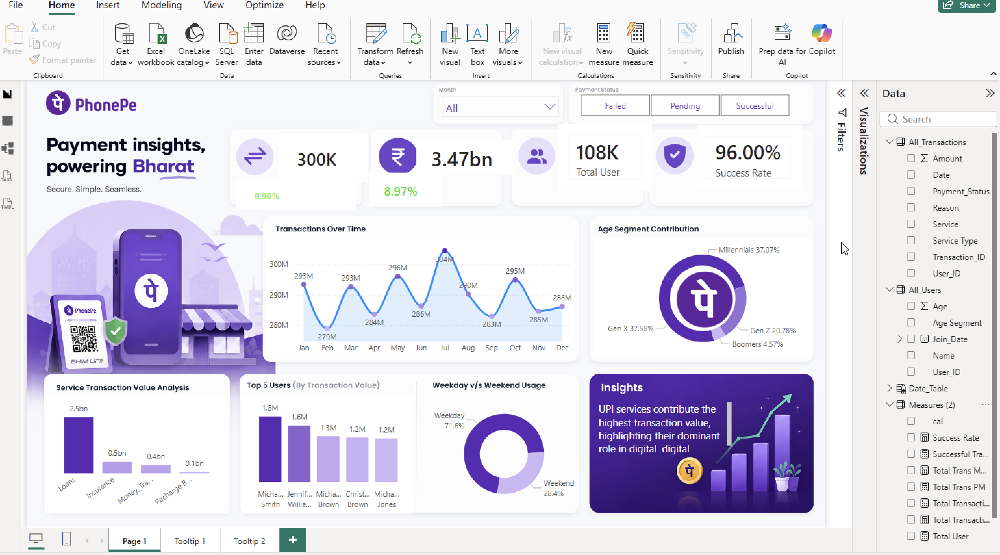
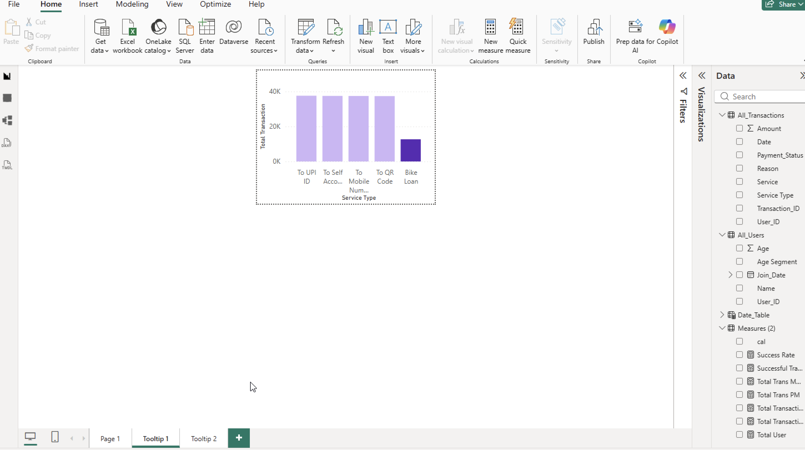
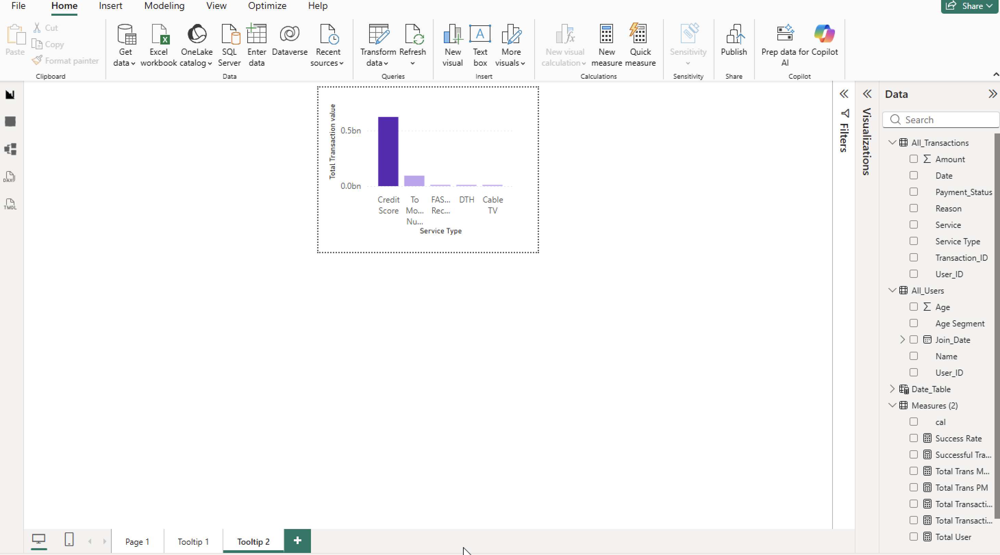

# 📈 PhonePe Transaction Dashboard

---

## 📸 Dashboard Preview

### Dashboard Overview



### Tooltip 1



### Tooltip 2



---

## 📌 Project Overview

This project is an interactive Power BI dashboard built to analyze PhonePe transaction data across different states and categories in India. The dashboard provides meaningful business insights using DAX, Power Query, data modeling, and interactive visualizations.

---

## 🚀 Features

- Interactive Power BI Dashboard
- State-wise Transaction Analysis
- Transaction Count & Amount Analysis
- Dynamic KPIs
- Custom Tooltips
- Interactive Filters & Slicers
- DAX Measures
- Power Query Data Transformation
- Business Insights

---

## 🛠 Tech Stack

- Power BI
- DAX
- Power Query
- Data Modeling
- CSV Dataset

---

## 📂 Project Structure

```text
PhonePe-Transaction-Dashboard
│
├── Dashboard
├── Dataset
├── Images
└── README.md
```

---

## 👨‍💻 Author

**Shubham Raj**

LinkedIn:
www.linkedin.com/in/shubham-raj-6bb8b7273
